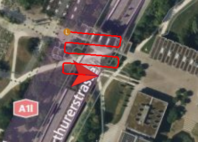
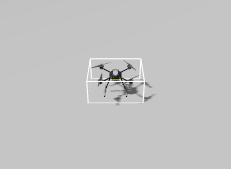

# 🚁 Drone Core - Otonom Drone Kontrol Sistemi

Bu proje, PX4/MAVSDK kullanarak drone'ları otonom olarak kontrol etmek için geliştirilmiş bir Python kütüphanesidir.

## 📁 Proje Yapısı

### 🎯 Models Klasörü
- **connect.py**: Drone bağlantı yönetimi
- **drone_status.py**: Drone durum takibi 
- **offboard_control.py**: Temel offboard kontrol fonksiyonları
  - Kalkış/iniş işlemleri
  - Mesafe tabanlı navigasyon (1m hassasiyet)
  - Hold mode fonksiyonları

### 🛸 Missions Klasörü  
- **waypoint_mission.py**: GPS waypoint navigasyonu (0.5m hassasiyet)
- **swarm_discovery.py**: Kare dalga oscillation misyonu (10 döngü)
- **multiple_waypoint_mission.py**: Çoklu waypoint görevleri

### 🧮 Optimization Klasörü
- **distance_calculation.py**: GPS mesafe hesaplamaları
- **pid.py**: PID kontrol algoritması
- **apf.py**: Artificial Potential Field navigasyonu

### 🧪 Test Klasörü
- **initial_yaw_deg_test.py**: Basit yaw açısı testi
- **waypoint_mission_test_simple.py**: Waypoint testi
- **connection_test.py**: Bağlantı testi

## 🏗️ Detaylı Class ve Fonksiyon Açıklamaları

### 📡 Models/connect.py - DroneConnection Class
```python
class DroneConnection(DroneStatus):
    async def connect(system_address, port):
```
- **Amaç**: MAVSDK ile drone bağlantısı kurar
- **Özellikler**: 
  - UDP bağlantı yönetimi (varsayılan: udp://:14541)
  - Global position bekleme kontrolü
  - Health check validasyonu
  - Telemetry task'larını başlatma

### 📊 Models/drone_status.py - DroneStatus Class
```python
class DroneStatus:
    async def update_position(drone):
    async def update_attitude(drone): 
    async def print_velocity(drone):
```
- **Amaç**: Real-time drone telemetri verilerini takip
- **Takip Edilen Veriler**:
  - GPS pozisyon (lat, lon, alt)
  - Yaw/Pitch/Roll açıları
  - Hız vektörleri (north, east, down)
  - Sistem status mesajları

### 🎮 Models/offboard_control.py - OffboardControl Class
```python
class OffboardControl(DroneConnection, DroneFunctionality):
    async def initialize_mission():
    async def go_forward_by_meter(distance, altitude, velocity, yaw):
    async def hold_mode(hold_time, angle_deg):
```
- **Amaç**: Temel offboard kontrol operasyonları
- **Ana Fonksiyonlar**:
  - `initialize_mission()`: Arm → Takeoff → Offboard mode başlatma
  - `go_forward_by_meter()`: Mesafe tabanlı ileri hareket (1m hassasiyet)
  - `hold_mode()`: Belirtilen süre ve açıda durma
- **Kritik Özellik**: Position setpoint ayarlayıp offboard mode başlatır

### 🗺️ Missions/waypoint_mission.py - WaypointMission Class
```python
class WaypointMission(OffboardControl):
    async def go_to_position(target_lat, target_lon, target_alt, hold_time):
```
- **Amaç**: GPS koordinat bazlı hassas navigasyon
- **Hassasiyet**: 0.5 metre durma kriteri
- **Hız Kontrolü**: 3 katmanlı (normal/yavaş/çok yavaş)
  - 5m+ → Normal hız
  - 2-5m → %50 hız
  - 0.5-2m → %20 hız
- **Real-time Distance**: Sürekli mesafe hesaplaması ve feedback

### 🔄 Missions/swarm_discovery.py - SwarmDiscovery Class
```python
class SwarmDiscovery(OffboardControl):
    async def square_oscillation_by_meters(forward_length, side_length):
```
- **Amaç**: Kare dalga oscillation pattern misyonu
- **Pattern**: İleri → Sol → İleri → Sağ (10 döngü)
- **Parametreler**: 
  - forward_length: 50m (ileri mesafe)
  - side_length: 10m (yan mesafe)
- **Yaw Kontrolü**: Drone-relative açı hesaplamaları

### 📐 Optimization/distance_calculation.py - CalculateDistance Class
```python
class CalculateDistance:
    @staticmethod get_lat_lon_distance(lat1, lon1, lat2, lon2):
    @staticmethod get_turn_angle(lat1, lon1, lat2, lon2):
    @staticmethod find_vectors(meters, angle_deg):
```
- **Amaç**: GPS koordinat hesaplamaları ve vektör dönüşümleri
- **Ana Fonksiyonlar**:
  - `get_lat_lon_distance()`: İki GPS koordinat arası mesafe ve yön
  - `get_turn_angle()`: Koordinatlar arası açı hesaplama
  - `find_vectors()`: Mesafe/açıyı north/east bileşenlerine ayırma
- **Kullanılan Kütüphane**: GeographicLib (WGS84 geodetik hesaplamalar)

### 🧪 Test Classes
```python
class InitialYawTest(OffboardControl):  # Basit yaw açısı test
class MultipleWaypointTest(WaypointMission):  # Çoklu waypoint test
```
- **Amaç**: Sistem fonksiyonlarını doğrulama
- **Test Kapsamı**: Bağlantı, kalkış, navigasyon, yaw kontrolü

## 🚀 Kurulum ve Çalıştırma

### Ön Gereksinimler
```bash
# PX4 SITL simülasyonu başlat
cd ~/PX4-Autopilot
make px4_sitl gazebo-classic

# Yeni terminalde Gazebo Harmonic
gz sim -v4 -r iris_runway.sdf
```

### Test Kodlarını Çalıştırma

#### 1. Basit Yaw Testi 🧭
```bash
cd /home/semih/drone-core
python3 test/initial_yaw_deg_test.py
```
- Drone kalkış yapar ve home yaw açısını gösterir
- 10 saniye o açıda kalır

#### 2. Waypoint Navigasyon Testi 📍
```bash
python3 test/waypoint_mission_test_simple.py
```
- GPS koordinatlarına hassas navigasyon (0.5m hassasiyet)
- 3 katmanlı hız kontrolü (normal/yavaş/çok yavaş)

#### 3. Kare Dalga Oscillation Misyonu 🔄
```bash
python3 missions/swarm_discovery.py
```
- 50m ileri, 10m yan hareket
- 10 döngü kare dalga paterni
- Drone-relative yaw hesaplamaları

#### 4. Çoklu Waypoint Misyonu 🗺️
```bash
python3 missions/multiple_waypoint_mission.py
```
- Birden fazla GPS noktasına sıralı navigasyon

## 🔧 Geliştirici Notları

### Kritik Noktalar
- **Offboard Mode**: Başlamadan önce position setpoint gerekli
- **Mesafe Tabanlı Durma**: Zaman tabanlı değil, GPS mesafe hesabı kullanılıyor
- **Hassasiyet**: go_forward_by_meter (1m), go_to_position (0.5m)
- **Hız Kontrolü**: Hedefe yaklaştıkça otomatik yavaşlama

### Kod Yapısı
```
DroneConnection → OffboardControl → [WaypointMission/SwarmDiscovery]
```

### Önemli Fonksiyonlar
- `initialize_mission()`: Arm + takeoff + offboard başlatma
- `go_forward_by_meter()`: Mesafe tabanlı ileri git (1m hassasiyet)  
- `go_to_position()`: GPS koordinatına git (0.5m hassasiyet)
- `square_oscillation_by_meters()`: Kare dalga paterni

## 🔍 Fonksiyon Detayları ve Kullanımı

### 🚁 initialize_mission()
```python
await drone.initialize_mission()
```
- **Sıralama**: Arm → Home position kayıt → Position setpoint → Offboard start → Takeoff doğrulama
- **Çıkış Yüksekliği**: 10 metre (sabit)
- **Hata Kontrolü**: Offboard start hatası yakalama
- **Süre**: ~5-7 saniye

### 📏 go_forward_by_meter(distance, altitude, velocity, yaw)
```python
await drone.go_forward_by_meter(20.0, 10.0, 2.0, 0.0)
```
- **Parametreler**: 
  - distance: Gidilecek mesafe (metre)
  - altitude: Uçuş yüksekliği 
  - velocity: Hız (m/s)
  - yaw: Yön açısı (derece)
- **Hassasiyet**: 1 metre kala durma
- **Hız Kontrolü**: Son 3 metrede %30'a düşme
- **Tracking**: Real-time mesafe feedback

### 🎯 go_to_position(lat, lon, alt, hold_time, speed)
```python
await drone.go_to_position(47.123456, 8.123456, 15.0, 5.0, 3.0)
```
- **3 Katmanlı Hız Kontrolü**:
  - 5m+ → Normal hız (100%)
  - 2-5m → Yavaş hız (50%) 
  - 0.5-2m → Çok yavaş (20%)
- **Hassasiyet**: 0.5 metre durma kriteri
- **GPS Hesaplama**: GeographicLib ile hassas mesafe
- **Hold Mode**: Varışta belirtilen süre bekleme

### 🔄 square_oscillation_by_meters(forward, side, alt, velocity)
```python
await drone.square_oscillation_by_meters(50.0, 10.0, 10.0, 2.0)
```
- **Pattern Dizisi**: 
  1. İleri (forward_length)
  2. Sol 90° + yan hareket (side_length)  
  3. İleri (forward_length)
  4. Sağ 90° + yan hareket (side_length)
- **Döngü**: 10 kez tekrar
- **Yaw Hesaplama**: Drone-relative açı kontrolü (home_yaw + offset)

## 🐛 Sorun Giderme

### PX4/Gazebo Process Cleanup
```bash
pkill -f px4
pkill -f gazebo
pkill -f gz
```

### Offboard Mode Sorunları
- Position setpoint ayarlandığından emin olun
- Home position initialize edilmiş olmalı
- Drone armed durumda olmalı

## 📊 Performans Metrikleri
- Navigasyon hassasiyeti: 0.5m - 1m
- Kalkış süresi: ~5 saniye 
- Offboard mode geçiş: ~2 saniye


